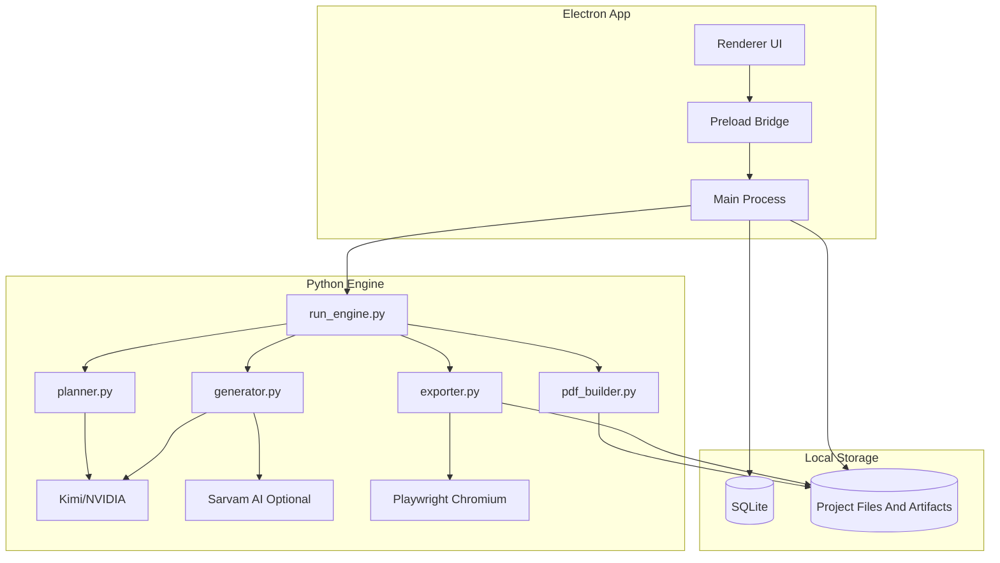

# PolyNovea Content Desktop App: Product Plan And Implementation Plan

This document converts the earlier architecture draft into a product plan that is safe to build against.

It is intentionally opinionated about two things:

1. `V1 must not be a throwaway MVP.`
2. `The current generator engine must be preserved first, then productized around stable boundaries.`

---

## 1. Executive Summary

PolyNovea already has a working local content-generation engine:

- `prompt files -> Kimi/NVIDIA -> HTML -> PNG export -> PDF for LinkedIn only`

That engine is useful for an operator, but not yet usable by a non-technical team. The product we should build is a local-first Electron desktop app that:

- hides prompt complexity
- uses a plan-first workflow
- supports multiple content modes
- stores revision history locally
- preserves the current engine behavior instead of rewriting it prematurely

The desktop app is not a browser deployment. It is a packaged internal tool for content production.

---

## 2. Problem Statement

### Current problem

The current repo requires:

- terminal usage
- prompt-file editing
- mode-specific folder discipline
- direct API-key management through `.env`
- manual understanding of export behavior

That is too brittle for a wider team workflow.

### Why this matters

If we wrap the current engine badly, we create a disposable MVP that will need a full rewrite once the team starts using:

- plan approval
- per-slide edits
- language overrides
- revision restore
- shared export workflows

The goal is not to prove that an app can exist. The goal is to build `V1` on stable architecture so that `V2` is additive rather than corrective.

---

## 3. Product Goals

### Primary goals

- Make the generator usable by non-technical team members.
- Hide prompt-engineering complexity behind mode-based workflows.
- Force a strong plan before final generation.
- Support revision history without exposing Git.
- Preserve current export fidelity.

### Non-goals for V1

- shared cloud collaboration
- browser deployment
- full backend dependency
- replacing the current HTML-rendering/export stack
- making Sarvam AI mandatory for all generations

---

## 4. Target Users

### Primary users

- internal PolyNovea team members creating social content and blog drafts
- non-technical operators who should not edit prompt files or run scripts

### Secondary users

- technical owners maintaining the desktop app and engine

### Important user constraint

Users should never need to:

- open terminal
- edit prompt text files
- use Git
- know which export pipeline is PDF versus PNG

---

## 5. Product Principles

1. `Plan first, generate second.`
2. `Preserve engine parity before abstraction.`
3. `Mode behavior is configuration-driven, not scattered through the UI.`
4. `User-facing version history is an app feature, not Git.`
5. `Language adaptation is optional and granular.`
6. `V1 must extend cleanly without a codebase reset in 1-2 months.`

---

## 6. Current Engine Reality

The current behavior in the repo should be treated as the source of truth:

- `LinkedIn`: generate HTML, export PNG slides, then compile PDF
- `Instagram`: generate HTML, export PNG slides only
- `Personal Instagram`: generate HTML, export PNG slides only
- `PDF` is `LinkedIn-only`
- rendering/export is based on generated `HTML + Playwright screenshots`

This matters because the first architecture draft abstracted too early. We should not invent a new mode system before we have captured current behavior accurately.

---

## 7. Product Scope

### Modes in scope

- `LinkedIn`
- `Instagram`
- `Threads`
- `Blog`

### Required V1 workflow

1. User selects mode.
2. User enters one plain-English direction.
3. App generates a proposed plan.
4. User reviews and edits the plan.
5. User approves the plan.
6. App generates final output.
7. App exports mode-specific artifacts.
8. App stores revision history and artifacts locally.

---

## 8. Required Product Behavior

### 8.1 Mode toggle

The app must expose a simple mode switch for:

- `LinkedIn`
- `Instagram`
- `Threads`
- `Blog`

Each mode maps to:

- prompt pack
- generation rules
- output constraints
- preview behavior
- export behavior

### 8.2 Plan-first workflow

The app must never jump directly from raw direction to final output.

For carousel modes, the plan should include:

- angle
- audience
- hook
- slide-by-slide structure
- tone
- CTA

For blog mode, the plan should include:

- title
- thesis
- section outline
- optional image concepts

### 8.3 User editing and approval

The user must be able to:

- review the generated plan
- edit the plan directly
- approve the plan

Only after approval should final generation run.

### 8.4 Revision history

The app must provide:

- save history
- revision history
- restore previous version
- export history

This is user-facing product behavior and must not depend on Git knowledge.

---

## 9. Language And Sarvam AI Strategy

Sarvam AI should be treated as an `optional language adaptation layer`, not the primary generator.

### Role split

- `Kimi/NVIDIA` remains the core planning and generation engine.
- `Sarvam AI` is used only when Indian-language, transliteration, or Hinglish/regional adaptation is requested.

### Critical rule

Do not model the system as:

- `Kimi calls Sarvam`

Model it as:

1. app orchestrates generation
2. Kimi produces plan or primary content
3. Sarvam optionally adapts selected content blocks
4. adapted content is merged back into the final artifact

### Granularity requirement

Language behavior must support:

- project-level default
- revision-level default
- per-slide override
- per-block override such as CTA

### V1 scope for Sarvam

To avoid premature complexity, V1 should support:

- final-copy adaptation
- project-level default language style
- per-slide override
- CTA override

V1 should `not` require planning-stage localization unless real usage proves that it is needed.

---

## 10. Export Model

This must be explicit because the earlier plan blurred it.

### LinkedIn

- generate HTML
- export PNG slides
- compile those PNGs into PDF

### Instagram

- generate HTML
- export PNG slides only

### Threads

Open product decision:

- `PNG-first carousel-like output`, or
- `copy-first thread output with optional visual cards`

Until decided, do not over-commit the architecture to Threads being identical to Instagram.

### Blog

- no carousel export flow
- final artifact is text or HTML-based output

### Core rule

`PNG export is the shared carousel primitive. PDF is a LinkedIn-only capability.`

---

## 11. Architecture Guardrails

These guardrails are required to prevent rewrite debt.

### Guardrail 1: Preserve parity before abstraction

Do not immediately convert everything into a new generic `/modes` abstraction.

First:

- capture current runner behavior exactly
- refactor into callable modules with parity
- verify outputs still match the current script behavior

Only then:

- introduce configuration-driven mode packs

### Guardrail 2: Separate stable layers

The app should be split into:

- `UI layer`
- `orchestration layer`
- `engine layer`
- `storage layer`
- `mode configuration layer`

These layers should grow independently.

### Guardrail 3: Keep Playwright in V1

Playwright exists because the engine generates `HTML`, not native image slides.

Current rendering pipeline:

- `LLM -> HTML -> Chromium render -> PNG -> optional PDF`

For V1, keep this flow. Do not replace it with a new rendering system.

### Guardrail 4: No thin schema that breaks on per-slide editing

The earlier revision schema was too blob-oriented. V1 must store structured plan and artifact metadata that supports:

- per-slide edits
- selective regeneration later
- per-slide language overrides
- artifact history

---

## 12. Recommended Architecture

### App shell

- `Electron`
- `React + Vite`
- `TypeScript`

### Local storage

- `SQLite` for app/project/revision metadata
- local filesystem for generated assets and exports

### Engine

- existing Python engine retained and refactored into modules
- Electron main process spawns Python sidecar jobs

### Rendering/export

- Python sidecar keeps using `Playwright`
- `img2pdf` remains LinkedIn-only export logic

### Why this is the right shape

It preserves the working engine and moves productization into the layers around it rather than destabilizing generation/export first.

---

## 13. System Design



---

## 14. Recommended Data Model

The earlier schema needs expansion. The minimum durable local model should be:

```sql
CREATE TABLE IF NOT EXISTS projects (
    id TEXT PRIMARY KEY,
    name TEXT NOT NULL,
    mode TEXT NOT NULL,
    created_at DATETIME DEFAULT CURRENT_TIMESTAMP,
    updated_at DATETIME DEFAULT CURRENT_TIMESTAMP
);

CREATE TABLE IF NOT EXISTS revisions (
    id TEXT PRIMARY KEY,
    project_id TEXT NOT NULL,
    version INTEGER NOT NULL,
    input_direction TEXT NOT NULL,
    input_context TEXT,
    status TEXT NOT NULL,
    error_message TEXT,
    created_at DATETIME DEFAULT CURRENT_TIMESTAMP,
    approved_at DATETIME,
    FOREIGN KEY(project_id) REFERENCES projects(id) ON DELETE CASCADE
);

CREATE TABLE IF NOT EXISTS revision_plans (
    revision_id TEXT PRIMARY KEY,
    plan_markdown TEXT NOT NULL,
    plan_json TEXT,
    FOREIGN KEY(revision_id) REFERENCES revisions(id) ON DELETE CASCADE
);

CREATE TABLE IF NOT EXISTS revision_slides (
    id TEXT PRIMARY KEY,
    revision_id TEXT NOT NULL,
    slide_index INTEGER NOT NULL,
    title TEXT,
    purpose TEXT,
    copy_text TEXT,
    language_code TEXT,
    language_style TEXT,
    override_notes TEXT,
    FOREIGN KEY(revision_id) REFERENCES revisions(id) ON DELETE CASCADE
);

CREATE TABLE IF NOT EXISTS revision_outputs (
    revision_id TEXT PRIMARY KEY,
    generated_html TEXT,
    generated_text TEXT,
    FOREIGN KEY(revision_id) REFERENCES revisions(id) ON DELETE CASCADE
);

CREATE TABLE IF NOT EXISTS artifacts (
    id TEXT PRIMARY KEY,
    revision_id TEXT NOT NULL,
    artifact_type TEXT NOT NULL,
    file_path TEXT NOT NULL,
    metadata_json TEXT,
    created_at DATETIME DEFAULT CURRENT_TIMESTAMP,
    FOREIGN KEY(revision_id) REFERENCES revisions(id) ON DELETE CASCADE
);

CREATE TABLE IF NOT EXISTS settings (
    key TEXT PRIMARY KEY,
    value TEXT NOT NULL
);
```

### Notes on this schema

- `plan_markdown` supports the editable plan surface
- `plan_json` supports future structured workflows
- `revision_slides` prevents immediate schema breakage when per-slide editing arrives
- `artifacts` cleanly tracks PNGs, PDFs, HTML snapshots, blog exports, logs

---

## 15. Secrets Strategy

The earlier plan stored API keys in plain SQLite without enough qualification.

### V1 recommendation

Use local settings UI, but do one of:

- store secrets via OS credential storage if practical, or
- store in SQLite only as an explicit internal-tool compromise with that risk documented

At minimum, the implementation plan must not present plain SQLite secret storage as if it were a security-neutral choice.

---

## 16. Target Folder Structure

This is the recommended target shape after parity-preserving refactor, not before.

```text
polynovea-content-desktop/
|
|-- package.json
|-- vite.config.ts
|-- src/
|   |-- main/
|   |   |-- index.ts
|   |   |-- db.ts
|   |   |-- engine.ts
|   |   `-- settings.ts
|   |-- preload/
|   |   `-- index.ts
|   `-- renderer/
|       |-- main.tsx
|       |-- components/
|       |-- views/
|       `-- styles/
|
|-- engine/
|   |-- run_engine.py
|   |-- planner.py
|   |-- generator.py
|   |-- exporter.py
|   |-- pdf_builder.py
|   |-- api_clients/
|   |   |-- kimi_client.py
|   |   `-- sarvam_client.py
|   `-- common/
|       |-- mode_loader.py
|       |-- models.py
|       `-- logging.py
|
|-- legacy/
|   |-- run.py
|   |-- biz/
|   `-- personal/
|
|-- context/
|-- templates/
|-- mode_packs/
|   |-- linkedin/
|   |-- instagram/
|   |-- threads/
|   `-- blog/
`-- docs/
    `-- implementation_plan.md
```

### Important note

Keep `legacy/` or equivalent parity references until the new engine runner is verified. Do not erase the current behavior too early.

---

## 17. What Can Be Reused, Refactored, Or Built New

### Reuse

- current context files
- current prompt assets
- current HTML generation logic patterns
- current Playwright export behavior
- current LinkedIn PDF assembly logic

### Refactor

- `run.py` into smaller engine modules
- prompt assembly into mode-pack-driven loading
- output handling into artifact-tracked export steps
- current environment/config loading into desktop settings-driven injection

### Build new

- Electron app shell
- SQLite metadata layer
- plan editor UI
- revision-history UI
- structured slide metadata model
- settings UI
- job orchestration and streaming status surface

---

## 18. Fixes Required Before Execution Starts

These are the required corrections to the previous architecture draft.

### Fix 1: Do not abstract modes before engine parity exists

The previous draft moved too quickly to generic mode configs. First wrap the current engine behavior exactly, then generalize.

### Fix 2: Treat LinkedIn PDF as mode-specific

Do not model PDF as a general carousel capability. It is LinkedIn-only.

### Fix 3: Narrow Sarvam V1 scope

Do not add planning-stage Sarvam localization in V1. Start with final-copy adaptation only.

### Fix 4: Replace blob-only revision storage

Per-slide overrides and selective future regeneration require structured slide records, not only markdown and JSON blobs.

### Fix 5: Treat Threads as a product decision, not an assumed carousel clone

Do not hardwire Threads into the exact Instagram export model until product direction is decided.

### Fix 6: De-prioritize cosmetic UI polish in early delivery

Workflow reliability, revision safety, and export behavior come before premium styling language.

### Fix 7: Clarify local secret handling risk

Do not present plain SQLite secret storage as if it requires no further decision.

---

## 19. Implementation Plan

This is the dependency-ordered delivery plan that avoids a near-term rewrite.

### Phase 0: Behavior Baseline

Goal: capture the current engine behavior exactly.

1. document existing mode behavior from current scripts
2. define parity fixtures for:
   - LinkedIn
   - Instagram
   - personal Instagram
3. verify current output paths and export rules

### Phase 1: Engine Stabilization

Goal: refactor the Python engine without changing behavior.

1. create `run_engine.py` as a thin orchestrator around current logic
2. extract:
   - Kimi client
   - prompt loader
   - exporter
   - PDF builder
3. keep current prompt/context behavior intact
4. add JSON progress streaming
5. verify parity against Phase 0 fixtures

### Phase 2: Mode-Pack Layer

Goal: introduce mode configs only after engine parity exists.

1. define `mode_packs/` shape
2. map current LinkedIn and Instagram behavior into mode packs
3. add blog mode separately
4. keep Threads provisional until product decision is locked

### Phase 3: Local Storage Layer

Goal: create durable project and revision storage.

1. implement SQLite schema
2. define artifact directories
3. add revision save and restore flows
4. add structured slide metadata persistence

### Phase 4: Electron Shell

Goal: make the engine usable without terminal access.

1. scaffold Electron + React + TypeScript app
2. implement preload bridge and IPC
3. implement Python-sidecar process manager
4. surface progress, logs, and retry states

### Phase 5: Plan-First Workspace

Goal: deliver the main product workflow.

1. new project flow
2. direction input
3. generate plan
4. edit plan
5. approve plan
6. generate final output
7. preview and export

### Phase 6: Language Adaptation

Goal: add Sarvam safely.

1. project-level language style setting
2. slide-level override support
3. final-copy adaptation pass
4. CTA override support

### Phase 7: Packaging And Distribution

Goal: ship a usable internal installer.

1. decide bundled vs first-run renderer strategy
2. package Python and runtime dependencies
3. verify Playwright renderer availability
4. validate installs on clean Windows machines

---

## 20. MVP Definition

V1 is complete when it can do all of the following reliably:

- create a project
- choose `LinkedIn`, `Instagram`, or `Blog`
- accept one plain-English direction
- generate a plan
- allow plan edits
- approve the plan
- generate final content
- export correct artifacts
- store and restore revisions locally

### Explicit V1 exclusions

- shared team sync
- cloud backend
- collaborative commenting
- mandatory Sarvam for all projects
- Threads final mode commitment if still undecided

---

## 21. Post-MVP Roadmap

### Next

- Threads mode finalized
- Sarvam presets for Hinglish and transliteration
- selective slide regeneration
- artifact diffing

### Later

- shared sync layer
- Supabase or equivalent only if team-wide shared history is needed
- auth and permissions
- remote rendering or job queue if local installs become limiting

---

## 22. Technical Risks And Mitigations

| Risk | Impact | Mitigation |
| --- | --- | --- |
| Engine refactor breaks current output parity | High | Baseline current behavior first and verify parity before introducing new abstractions |
| Playwright/Chromium runtime not available on user machines | High | Decide packaging strategy explicitly and build renderer diagnostics into the app |
| Per-slide editing forces schema redesign | High | Store structured slide records from V1 |
| Sarvam integration adds complexity too early | Medium | Limit V1 to final-copy adaptation only |
| Threads mode is mis-modeled | Medium | Keep Threads as a scoped product decision, not a hardcoded carousel clone |
| Plain local secret storage is insufficient | Medium | Prefer OS-backed secret storage or document local-storage compromise explicitly |

---

## 23. Recommendation

Proceed with:

- `Electron`
- `local-first storage`
- `SQLite + local filesystem`
- `Python sidecar engine`
- `Playwright retained for V1`
- `LinkedIn PDF only`
- `Sarvam optional and narrow in V1`

Do not proceed with:

- broad early abstraction
- browser deployment
- backend dependency in V1
- blob-only revision storage
- a cosmetic-first UI plan

This is the safest route to a usable internal product that does not need to be rebuilt in a month or two.
